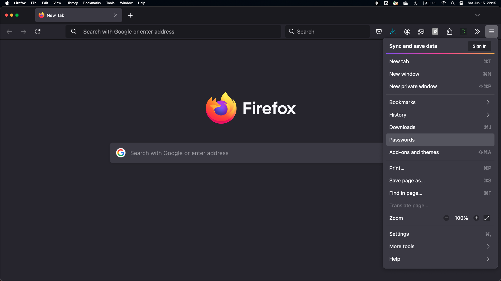
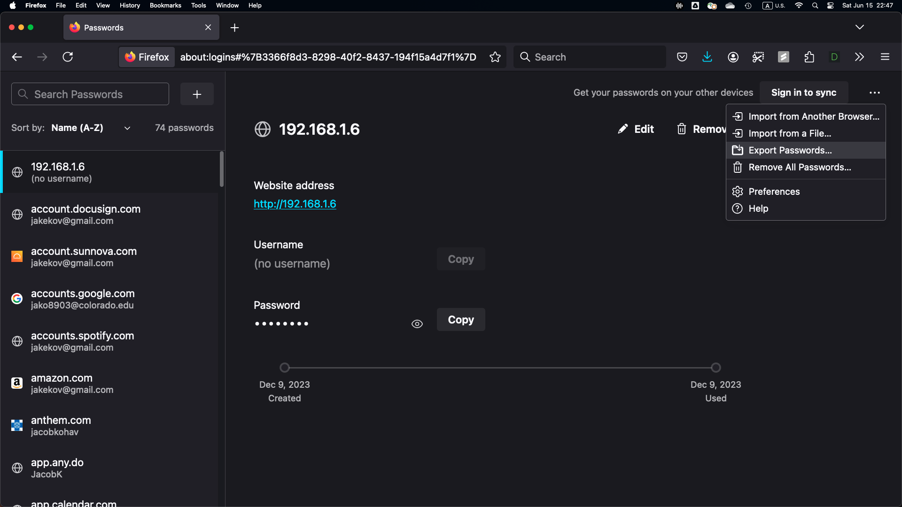
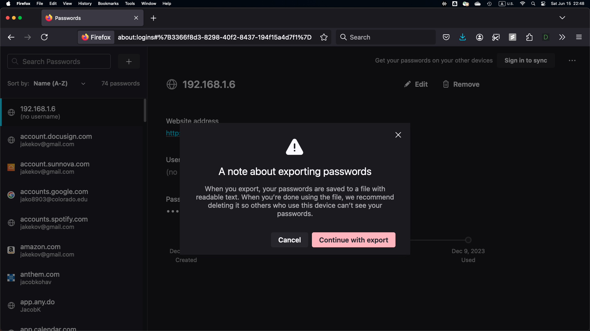
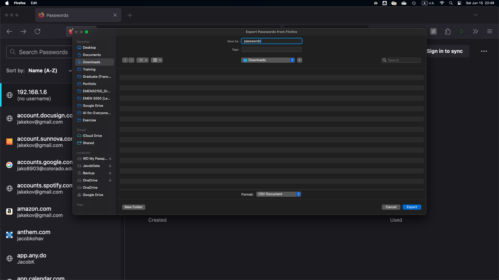

# firefox-password-obsfuscator
firefox-password-obsfuscator

A program executable on an exported `Mozilla Firefox` browser saved password export to obfuscate authetnication credentials for further reference and/or backup.

## Dependencies
* `Pandas`
* `Numpy`
* `Tabulate`
* `DateTime`

## How to use
* Clone this repository
* Export your passwords saved in Mozilla Firefox into the directory above the repository's directory

  * Open the `Passwords` manager
    

  * Select `Export Passwords...` option
    

  * Confirm with warning regarding exposed authentication credentials with `Continue with export`
    

  * Save exported `passwords.csv` credentials file
  

    * Ex. if the repository is in `desktop/firefox-password-obsfuscator`, place the exported `passwords.csv` into `desktop/`. 

    * The structure should look akin to the following from the example:

      ```
          ├── desktop/
          │   ├── firefox-password-obsfuscator/
          │   │   ├── <repository_files>
          │   ├── passwords.csv
      ```
      
* Execute the program with relevant commands from the directory above
  
  * Ex. from `/desktop/` where the repository is nested relative as `/desktop/firefox-password-obsfuscator`

    ```
    python3 firefox-password-obsfuscator/password_obfuscate.py
    ```

* The program will output a file with naming convention such as `creds_obfuscated_2024-06-15_22h33m14s.csv`

## Tips
* Reformat the outputted `.csv` file in MSExcel for printability

## TODOs
* [ ] Dictionary for correcting common domain names to associated organiation's name
* [ ] Categoriation of domain names by resource type
* [ ] Single-page printable formatting